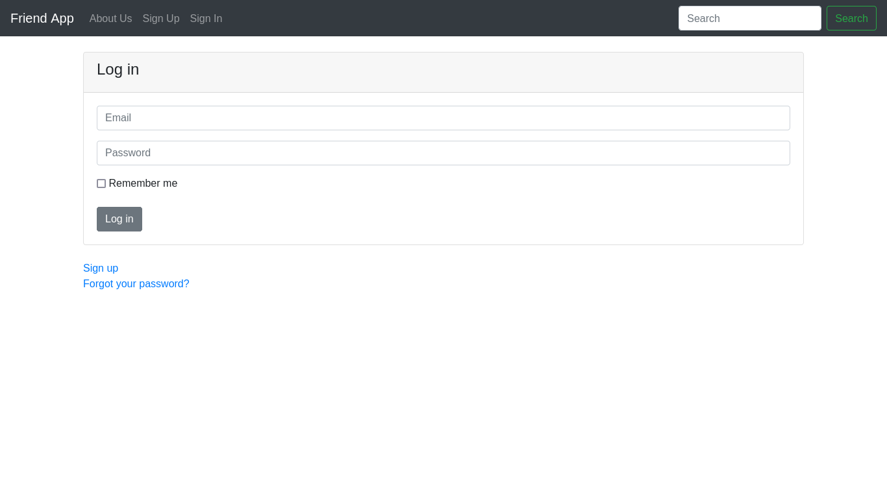

# Friends app

## Project Details

Ruby on Rails friends app.



## System Requirements

* Ruby 3.3.6
* Rails 8.0.1

## Running
```bash
git clone https://github.com/cryptrunner49/rails-friends
cd rails-friends
rails db:migrate
rails server
```

## Running with docker or podman
### docker
```bash
git clone https://github.com/cryptrunner49/rails-friends
cd rails-friends
sudo docker build -t rails-friends .
sudo docker run -d -p 127.0.0.1:3000:3000 rails-friends
```
### podman
```bash
git clone https://github.com/cryptrunner49/rails-friends
cd rails-friends
podman build -t rails-friends .
podman run -d -p 127.0.0.1:3000:3000 rails-friends
```

## Running with docker compose or podman-compose
### docker compose
```bash
git clone https://github.com/cryptrunner49/rails-friends
cd rails-friends
sudo docker compose up
```
### podman-compose
```bash
git clone https://github.com/cryptrunner49/rails-friends
cd rails-friends
podman-compose up
```